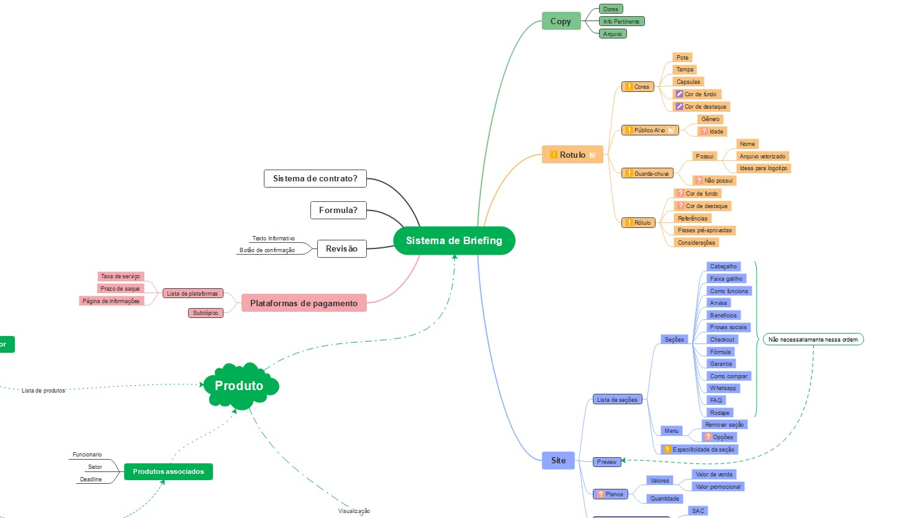
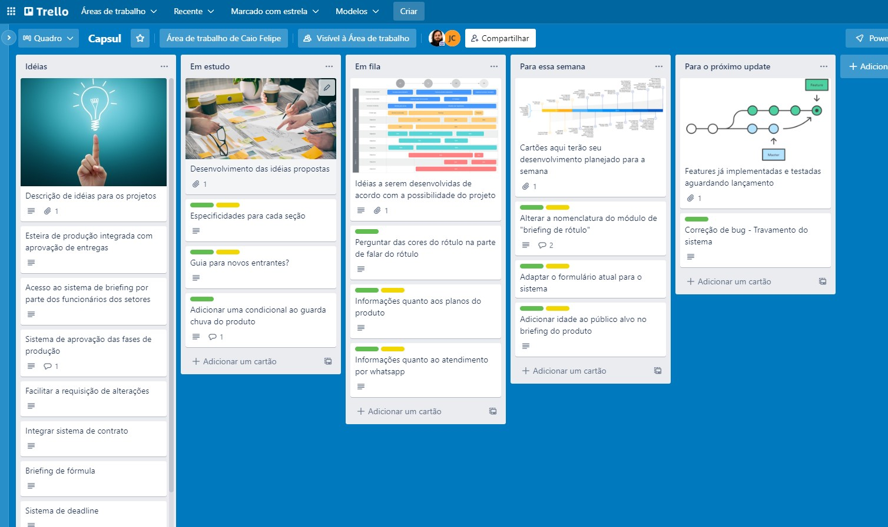

# Self Organization

When I started to work as programmer most of my problems came from non-comprehensive week schedules unorganized ideas on mind, I would like to suggest a way to put all that mess in order and even show to other team members.

## Scoping Ideas

Some people uses a notebook and just turn the brainwaves into a lot of words, after that needs to reconstruct the original concepts in mind and when it happens, your brain have to spend more energy on remembering than implementing new possibilities, so it's to change the method of documenting your proposal on something that anyone easily understand and can add more points on it causing a natural brainstorm, so I suggest: **Mindmapping**

### Mind-maps

A wonderful tool to planning structures, systems, workflows and much more. It's easily associative with the _SQL's entities diagram._

The creative process is pretty much close to programming: you have a bigger problem to solve, cut it into pieces, and that pieces will have it's own dependencies to be solved. In the end of day the solution will be tracked step-by-step almost like magic, and when needs to be updated the process stills intuitive and convenient to keep growing without major problems.

### Card lists

This is a well-known tool for almost everyone that worked into a team on high school, works like a charm in order to define a sequence of things that have to been done in a certain period, it's even possible to track results and deadlines.

## Put it all together!

You don't need to use only one tool to do some self-organization, you can use a large range of free-to-use web tools at the same time, but beware... Try not to be redundant, use every tool as a weapon to unique necessity you have.

I personally use _Mind-maps_ to define every specification and connection between possible projects. I show them to my team and ask for some inputs, organize it, after a common approval, list everything on a _Card-list_ ordered by priority with some delivery preview date to report it to team leader/PO/CEO.

## Don't get yourself drown in mental confusion

This is not a perfect workflow, it can be adapted to your needs, you can add/remove tools or change it entirely but **keep yourself organized**, a organized schedule gives more space in your brain to think on your work.

### Encore...

You can apply the same logic to your code, when you develop a new feature, you can help yourself in future and other team members, **documenting it**. The already mentioned tools are a good option for documentation too, you just need to show to another person in a understandable way how your implementation works. Simple as that. 
